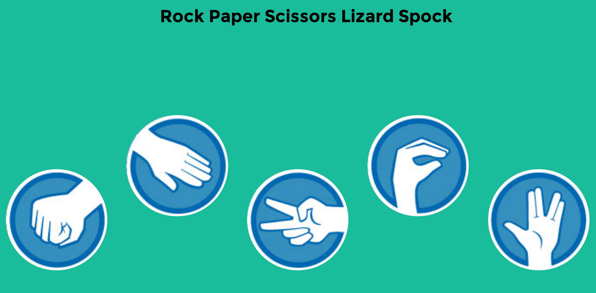
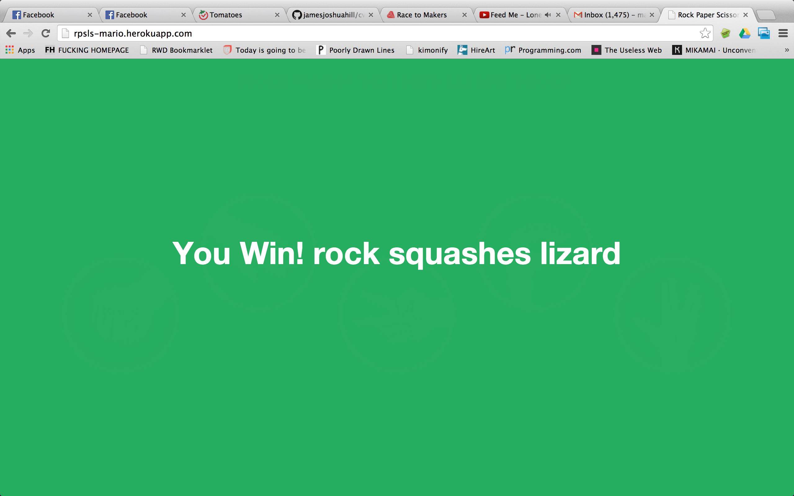

## Rock-Paper-Scissors-Lizard-Spock

It's an expansion of the classic selection
method game rock-paper-scissors. It operates on the same basic principle, but
includes two additional weapons: the lizard (formed by the hand as a sock-puppet-like mouth)
and Spock. Source: [Wikipedia](http://en.wikipedia.org/wiki/Rock-paper-scissors-lizard-Spock)

The bot's decision is completely randomized. The player is notified after he's chosen a move
with a flash message - not lasting more than 3 seconds - with the result of the game:

This is accomplished by a div that covers the entire page but lies underneath everything by default. So everytime
a player makes a pick the css attribute changes briefly covering the entire browsers with 3 possible options: winning, loosing or drawing.

This task was assigned to us by [@alexpeattie](https://github.com/alexpeattie) it's week 7 at Makers Academy,
and we've been introduced to Javascript for the first time. Our stack:

* Javascript, using jQuery
* Ruby
* HTML & CSS
* Git version control
* Test-driven-development with RSpec and Jasmin.

The game can be played [here](http://rpsls-mario.herokuapp.com/)

#### Issues to be resolved

* Cursor does not fade away when the cursor is hovering on the text on any of the images
